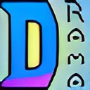
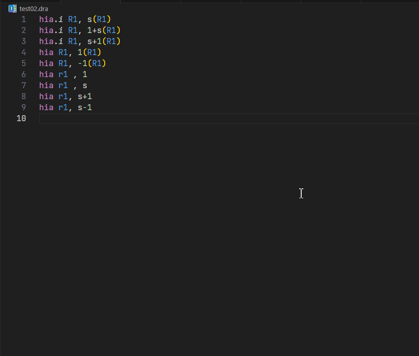

    
    <h1>vsc-drama-support</h>

This extension adds support for the DRAMA language (Decimale RekenAutomaat met Meerdere Accumulatoren) or (Decimal Calculator with Multiple Accumulators).
At the moment it only does syntax highlighting and formatting.

## Features

- syntax highlighting for .dra files

 
 - Formatting, formats .dra files into a format used in the book with several customization options

  