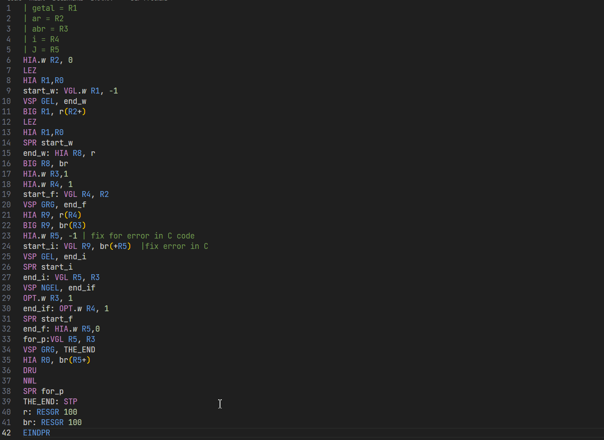

# vsc-drama-support

This extension adds support for the DRAMA language (Decimale RekenAutomaat met Meerdere Accumulatoren) or (Decimal Calculator with Multiple Accumulators).
At the moment it only does syntax highlighting.

## Features

- syntax highlighting for .dra files




 
 ### Formatter
 - formats drama files into a more readable format
 - has options, for keywords and labels
  

---
## Release Notes

Initial release of

### 0.0.1

---
## DRAFT

## Notes self
linter: rules: resgr, empty lines
## quirks in DRAMA:
 - Allows RESGR with negative numbers (acts as positive), no arguments (does not reserve any memory space)
 - Allows numbers to prefixed with a plus sign, except when a sign is already used
 - doens't check the dot for the mode thus allows you to put any character there (except space)
 - Allows labels to defined as keywords, thus allowing labels to shadow keywords, 
 this has some major implications as register now can be defined as label/symbol
 and now either functions as register, in a context that only register is as allowed or as as symbol if a symbol is allowed
 this allows for some crazy constructs, see the following:
 ```
 HIA.a: NWL
 SPRxD r1+69(-R1)
 spr HIA.a 
 STP
 R1: RESGR -99
 ```
 OR
 ```
HIA.w r1, 5
HIA.W R0, r1+0(R1) | who needs addition if you can do this?
DRU | 10
NWL
STP
R1: RESGR 
 ```
or

```
hia.w R0, +1 | valid
hia R0, +1(R9) | valid
hia.w R0, 1+s | valid
hia.w R0, +1+s | not valid, this is inconsistent either no plus prefix is allowed or it should always be
hia.w r0, -1+s | not valid
HIA.w R0, S-1 | valid
STP
S: RESGR
```

Thus i have decided to make a few decisions different from the one the DRAMA simulator does.
In regards from valid syntax, in my attempt to formalise the spec of DRAMA

- First change, is that I only allow the dot as separator between the mode and instruction (Although not allowing dots in the label or using different separator would make parsing a lot easier, as it removes some ambiguity)
- I do not allow plus prefixes for numbers
- labels which match keywords or keywords + mode are not valid
- RESGR , only allows strict positive numbers as arg, and is no longer optional


# TODOS
- UPdate syntax highlighting to add s+1 garbage
- optional Program line only line support, only actual instructions count as line

todo
clean up grammar
ADD missing support for ARRAY declaration using <LABEL:>  VALUE; VALUE; VALUE

formatter todos:
- formatting bs s+t possible leave as is
- options: move comments at instruction level
- dont touch bad lines


# CONFIG formatter
- (un)capitalize labels / dont change
- also for keywords
- alignment label
- multiple layer labels